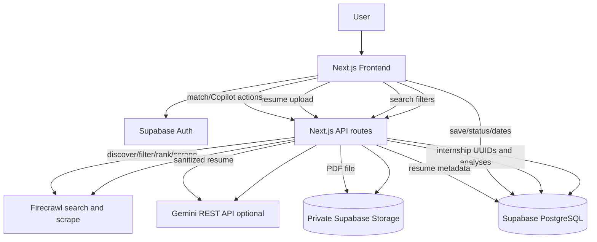

# InternScout AI — Technical Handoff

> Repository-generated context for another AI assistant. This describes only behavior evidenced by the current repository. If live Supabase state cannot be proven from migrations, it is explicitly marked as not determinable.

## 1. Project Overview

InternScout AI is a Next.js internship discovery and application-assistance platform for students. Authenticated users search for internships, receive filtered and verified opportunities, save and track applications, manage preferences and alerts, upload resumes, compare resumes to internships, and generate application content.

High-level flow:

```text
Search filters → /api/search → Firecrawl discovery → local filtering/ranking
→ limited scraping → extraction → eligibility/match/verification
→ Supabase persistence → UUID-bearing results → save/tracker/resume/Copilot
```

## 2. Core Features

### Search and discovery

`app/page.tsx` owns the dark search UI, filters, loading/errors, result cards, save actions, session-storage restoration, and “More Opportunities”. `app/api/search/route.ts` validates filters, checks fresh cached rows, generates up to five queries, searches Firecrawl concurrently, normalizes/deduplicates URLs, separates community results, filters aggregators/listing pages, ranks/diversifies, selects at most three candidates, scrapes only those candidates, extracts fields, evaluates eligibility/match/verification, persists valid results, and returns JSON.

### Query generation

Interactive queries combine role with mode/location, up to three skills, graduation-year student wording, fresher wording, and a mixed Greenhouse/Ashby/Lever query. The list is unique and capped at five. `lib/discovery-queries.ts` contains separate fixed queries for scheduled discovery.

### Filtering and quality

Social/community links are retained in `communityResults` but are not job listings. Aggregator domains (Glassdoor, LinkedIn, Indeed, Naukri, Internshala, ZipRecruiter, SimplyHired, Monster) and obvious search/listing URLs are rejected before candidate selection. Search markers include `SRCH_`, `/search`, `/search-results`, `/listing(s)`, query-bearing `/jobs`, and common query/pagination parameters.

URLs are normalized to HTTPS, tracking parameters and fragments removed, and trailing slashes removed. Exact normalized URLs are deduplicated. Company+role normalization collapses obvious duplicate opportunities. Domain round-robin ordering and `applyDomainCap()` prevent one domain dominating. `SCRAPE_BUDGET` is 3.

### Persistence and saved jobs

`lib/internships.ts` uses a server-only service-role client. `upsertInternship()` looks up by `source_url`, updates by ID or inserts, selects the resulting row, and returns its UUID. `persistVerificationResults()` uses `Promise.allSettled()`, skips missing-company records, and maps IDs to both `internship.id` and `internship.internshipId`.

The frontend saves analyzed jobs using the database UUID. `/api/internships/lookup` repairs cached result IDs server-side. Tracker and dashboard read user saved records. The exact live definition of `saved_internships` is not created in repository migrations; known code fields include `user_id`, `internship_id`, `application_status`, `created_at`, notes, and optional date fields.

### Authentication and supporting features

`lib/supabase/server.ts` creates cookie-backed server clients; `lib/supabase/client.ts` creates browser clients; `middleware.ts` refreshes sessions. `AuthNav` provides sign-out/navigation. Preferences, job alerts, alert matches, notifications, search history, recommendations, tracker/dashboard, resumes, and Copilot are implemented in their corresponding `app/` pages and libraries.

## 3. Complete User Journey

1. User opens the search page and signs in when needed.
2. Filters are validated in the browser and POSTed to `/api/search`.
3. The route validates again and checks fresh active cache rows.
4. A cache hit returns cached analysis without Firecrawl; otherwise up to five searches run concurrently.
5. URLs are normalized/deduplicated; aggregators/listing pages are removed and community links separated.
6. Results are marked against `shown_internships`, diversified/ranked, and three or fewer candidates selected.
7. Selected pages are scraped concurrently with failure isolation.
8. Structured fields, eligibility, match, and verification are calculated.
9. Valid internships are persisted and public database UUIDs attached.
10. The frontend displays analyzed cards and additional opportunities, saving the payload in sessionStorage.
11. Save Job inserts the authenticated user’s saved record.
12. Tracker, dashboard, and recommendations reuse those records.
13. User can upload a PDF, run resume match, and use Copilot for application content.

## 4. Technology Stack

| Category | Technology | Purpose | Where used |
|---|---|---|---|
| Framework | Next.js 16.3.3 | App Router UI/API | `app/` |
| UI | React 19.2.8 | Components/state | Pages/components |
| Language | TypeScript | Type safety | Source tree |
| Styling | Tailwind CSS 4 | Dark UI | JSX/classes |
| Backend | Supabase JS 2.112.4, SSR 0.12.5 | Auth, PostgreSQL, Storage | `lib/supabase`, routes |
| Discovery | Firecrawl 4.35.0 | Search and selected scraping | Search/scheduled discovery |
| AI | Gemini REST API | Optional enhancement | `lib/gemini.ts` |
| Tests | Vitest 4.1.11 | Pure discovery tests | `tests/` |
| PDF extraction | TextDecoder heuristic | Initial PDF text extraction | Resume upload route |

## 5. Frontend Architecture

Important pages: `app/page.tsx` search; `dashboard/page.tsx`; `tracker/page.tsx`; `preferences/page.tsx`; `alerts/page.tsx`; `alerts/matches/page.tsx`; `notifications/page.tsx`; `search-history/page.tsx`; `recommendations/page.tsx`; `resume/page.tsx`; and `copilot/page.tsx`.

`AuthNav` centralizes authenticated navigation/sign-out. `NotificationBell` reads notification rows and marks read state. `SearchableMultiSelect` supplies dynamic suggestions, curated fallback, chips, keyboard navigation, and custom values. Search state includes filters, verification results, save/loading messages, and session-storage restoration.

## 6. Backend/API Architecture

| Route | Method | Auth | Purpose | External services |
|---|---|---|---|---|
| `/api/search` | POST | Search can be public; user cache tracking is authenticated | Discovery/analyze/persist | Firecrawl, Supabase |
| `/api/internships/lookup` | POST | Required | Repair/persist cached objects and return IDs | Supabase |
| `/api/suggestions` | GET | Optional | Suggestions plus fallback values | Supabase |
| `/api/resume/upload` | POST | Required | Validate/upload PDF and save metadata | Supabase |
| `/api/resume/match` | POST | Required | Deterministic plus optional Gemini match | Supabase, Gemini |
| `/api/copilot` | POST | Required | Generate/cache application content | Supabase, Gemini |
| `/api/cron/job-alerts` | POST | Bearer `CRON_SECRET` | Run alert matching | Supabase |
| `/api/cron/discover-internships` | POST | Bearer `CRON_SECRET` | Scheduled discovery | Firecrawl, Supabase |
| `/auth/callback` | GET | OAuth callback | Exchange auth code | Supabase Auth |

Cron GET requests return 405. Auth failures return 401 and internal failures use safe generic responses.

## 7. Internship Search Pipeline

The route parses and validates `SearchFilters`, then calls `getCachedInternships()` for fresh active rows. At least three suitable cached rows produce a cache response without Firecrawl.

The normal path calls `generateSearchQueries()`, runs `firecrawl.search(query, { limit: 5 })` with `Promise.all`, and collects `results.web`. `normalizeResultUrl()` handles protocol, fragments, tracking parameters, and slashes. A Map removes duplicate normalized URLs.

`annotatePreviouslyShown()` checks per-user normalized URLs in `shown_internships`; `recordShownInternships()` upserts surfaced URLs after processing. `filterSearchResults()` excludes aggregators, listing/search pages, explicit non-internship roles, and irrelevant pages. Community/social/blog results remain separate.

`diversifyResults()` round-robins domains. `applyDomainCap()` limits the surfaced set to approximately 40% per domain, with an upper cap of three. Candidate scoring prefers specific internships, student eligibility, non-generic pages, and higher source priority; previously shown results are deprioritized. Candidate selection first takes one result per domain and never exceeds three.

`scrapeSelectedCandidates()` scrapes only those candidates using Firecrawl and `Promise.allSettled()`. Extraction computes application URL, company, role, description, location, work mode, skills, experience, education, stipend, and duration. Valid records are persisted, IDs attached, and the response returned.

## 8. Data Extraction and Company Resolution

Markdown/text is cleaned by removing image syntax, formatting, links, URLs, and empty lines. Description extraction prefers “About the Role”, “Job Description”, “What You’ll Do”, and responsibility headings, stopping at major requirement/benefit/about sections. Education extraction searches Qualifications, Requirements, Education, Academic Background, and labeled fields.

Application links prefer markdown links containing “apply”, otherwise source URL. Skills use a fixed recognized vocabulary. Location, work mode, stipend, duration, and experience use conservative regexes.

Company resolution order is:
1. `Company - Role` title format.
2. ATS path slugs for Lever, Greenhouse, and Ashby.
3. Non-ATS/non-aggregator root-domain normalization, including known `jpmorganchase.com` mapping.
4. Null when no meaningful value exists.

Missing company causes persistence of only that result to be skipped. JSON-LD/Open Graph extraction is not implemented in the current route.

## 9. Database Architecture

Migrations define:

- `internships`: global cache, UUID ID, job fields, verification fields, status/timestamps, source URL uniqueness in migration 001, indexes, trigger, RLS.
- `user_preferences`: one user row with JSONB arrays and graduation/experience fields.
- `job_alerts`: user alert definitions and active/check fields.
- `job_alert_matches`: alert/source match score and reasons, unique alert/source pair.
- `notifications`: user notifications with dedupe key and read state.
- `search_history`: user filter JSONB and timestamp.
- `user_resumes`: user metadata, storage path, extracted text.
- `resume_analyses`: unique user/resume/internship JSON result.
- `application_copilot_outputs`: unique user/resume/internship/output-type content.
- `shown_internships`: user/normalized URL primary key and first/last shown timestamps.

`saved_internships`, `profiles`, and `public.users` are referenced by code/migrations but their complete creation definitions are not in this repository. Exact live columns are not determinable from repository files. Migrations 007–009 repair ownership foreign keys; migration 015 aligns `internships.company` with the confirmed live NOT NULL constraint.

## 10. Row Level Security

RLS is enabled on migration-created user-owned tables. Policies use `auth.uid() = user_id` for ownership. Update policies include both `USING` and `WITH CHECK`. Alert-match selection verifies ownership through the parent alert. Resume storage policies restrict the first path folder to the authenticated user ID.

Browser operations use authenticated sessions and RLS. Server cookie clients use `lib/supabase/server.ts`. Service-role access is confined to `createPersistenceClient()` and server routes.

## 11. Supabase Storage

Migration 012 creates a private `resumes` bucket. Files use `<user-id>/<resume-id>.pdf`. Upload validates PDF type and a 5 MB limit, uploads privately, extracts text, inserts metadata, and removes the file if metadata persistence fails. Storage policies scope access by the first path segment.

## 12. Internship Persistence and Save Job Flow

Search analysis creates `InternshipInsert` records. `upsertInternship()` finds by source URL, updates or inserts, selects the row, and throws if no UUID is returned. `persistVerificationResults()` isolates writes with `Promise.allSettled()` and logs failures.

The API sets both `internship.id` and `internship.internshipId` to the returned UUID. The frontend preserves both in fresh results and session storage. Cached objects without IDs are repaired through the authenticated lookup/persist endpoint.

Save Job resolves `internshipId ?? id` and inserts `user_id`, `internship_id`, and `application_status: "saved"`. Tracker/dashboard/recommendations use the same saved records. Missing UUIDs or failed persistence never produce a false Saved state.

## 13. Resume System

Authenticated PDF upload is limited to 5 MB. Server extraction uses a Latin-1 `TextDecoder` heuristic, removes null bytes/basic escapes, and stores text. `sanitizeResumeText()` removes emails, phone numbers, addresses, and truncates to 18,000 characters.

`analyzeResumeMatch()` compares normalized skills and role words, extracts project/experience sentences, reports education/experience concerns, computes a bounded 0–100 score, assigns a recommendation, and creates suggestions. The match route may merge Gemini JSON and caches by user/resume/internship.

## 14. Gemini AI Integration

`lib/gemini.ts` uses model `gemini-3.6-flash` at `https://generativelanguage.googleapis.com/v1beta/models/gemini-3.6-flash:generateContent`. It reads `GEMINI_API_KEY?.trim()` server-side and sends `x-goog-api-key`. Requests use `contents[].parts[].text` and temperature 0.2.

Resume match and Copilot call Gemini only when configured. Resume text is sanitized first. Responses are parsed as text/JSON; failures are logged server-side and deterministic behavior remains the fallback. No secret values are included in this report.

## 15. Application Copilot

Copilot requires authentication, a saved internship, and a latest resume. It loads internship, resume, and cached match data, then checks `application_copilot_outputs`. Deterministic templates cover good fit, cover letter, HR message, cold email, follow-up, interview prep, and highlight guidance. Optional Gemini generation is instructed not to invent facts. Results are cached per user/resume/internship/type with RLS.

## 16. Caching and Credit Optimization

Fresh active internship caching can skip Firecrawl. Search payloads are stored in `sessionStorage` under `internscout:latest-search-results`; restoration makes no search call. Cached ID repair uses one server request and no Firecrawl. Only three candidates are scraped. Aggregator/listing filtering runs before scraping. URL and title deduplication, shown-result tracking, resume-analysis caching, and Copilot caching reduce repeated work.

## 17. Environment Variables

| Variable | Purpose | Scope | Required |
|---|---|---|---|
| `NEXT_PUBLIC_SUPABASE_URL` | Supabase URL | Browser/server | Yes |
| `NEXT_PUBLIC_SUPABASE_PUBLISHABLE_KEY` | Public Supabase key | Browser/server | Yes |
| `SUPABASE_SERVICE_ROLE_KEY` | Persistence client | Server only | Persistence |
| `FIRECRAWL_API_KEY` | Firecrawl | Server only | Discovery |
| `CRON_SECRET` | Cron bearer authorization | Server only | Scheduled routes |
| `GEMINI_API_KEY` | Optional Gemini | Server only | Optional enhancement |

## 18. Security Architecture

Supabase Auth identifies users and middleware refreshes sessions. RLS scopes user-owned rows. Service-role credentials are used only by server helpers/routes. Resume files are private and path-scoped. Resume text is sanitized before Gemini. Cron endpoints require bearer authorization. Error responses avoid exposing secrets and internal credentials.

## 19. Error Handling and Fallbacks

Firecrawl searches/scrapes are isolated; empty query results do not abort the route. Invalid URLs and listing pages are removed before scraping. Missing company skips only the affected persistence item. Persistence failures are logged and do not block other records. Missing UUIDs prevent false saves, while lookup repair can recover rows. Upload cleans orphaned files. Gemini failures fall back deterministically. Unauthenticated operations return 401; cache/tracking failures generally fall back silently.

## 20. Testing

`tests/discovery-quality.test.ts` uses Vitest and covers domain capping, URL normalization, dated-vs-unknown freshness, shown-result deprioritization, and ATS/direct-company extraction (Lever, Greenhouse, Ashby, title format, aggregator/unresolvable, direct domains). The suite was run with `npx vitest run --pool=threads`; all current tests passed. There are no end-to-end, RLS, Firecrawl, Gemini, or live-network tests.

## 21. Current Project Structure

```text
app/
  page.tsx
  dashboard/ tracker/ preferences/ alerts/ notifications/
  recommendations/ search-history/ resume/ copilot/
  api/search/ suggestions/ internships/lookup/ copilot/
  api/resume/{upload,match}/ api/cron/{job-alerts,discover-internships}/
components/{AuthNav,NotificationBell,SearchableMultiSelect}.tsx
lib/{internships,job-alerts,recommendations,resume-match,application-copilot,gemini,scheduled-discovery,discovery-queries,suggestion-options}.ts
lib/supabase/{client,server}.ts
types/internship.ts
supabase/migrations/001_... through 015_...
tests/discovery-quality.test.ts
package.json, middleware.ts, next.config.ts, vercel.json, vitest.config.ts
```

## 22. Known Limitations / Potential Issues

- PDF extraction is heuristic and may miss text.
- Posting freshness depends on available source timestamps.
- Firecrawl markup varies, making extraction best-effort.
- Gemini can fail or return malformed output.
- Exact live schemas for externally created saved/profile tables are not determinable here.
- Service-role/deployment secrets must be configured correctly.
- Domain caps can reduce visible result count when one source dominates.
- Notifications are in-app only; no delivery service exists.
- No comprehensive end-to-end test suite exists.

## 23. Future Improvement Opportunities

### High Priority

- Generate Supabase database types to prevent schema drift, especially for saved internships.
- Replace heuristic PDF extraction with a maintained PDF parser.
- Add mocked integration tests for Save Job, UUID propagation, and RLS behavior.

### Medium Priority

- Persist posting dates from structured metadata.
- Add Gemini model capability/configuration checks.
- Improve company resolution using structured JobPosting/Organization metadata.

### Low Priority

- Add source-diversity/cache-hit analytics.
- Add notification delivery integrations later.
- Add retention/pagination for search history and shown records.

## 24. Architecture Diagram



## 25. AI HANDOFF SUMMARY

### Project Identity

InternScout AI is a Supabase-backed Next.js platform for controlled internship discovery and personalized application assistance.

### Current Architecture

Next.js App Router, Supabase Auth/RLS, server-only service-role persistence, Firecrawl with a five-query/three-scrape budget, shared TypeScript types, and deterministic resume/Copilot fallbacks with optional Gemini.

### Important Data Flows

- Search: filters → discovery/filter/rank/scrape/extract/analyze/verify → persistence → UUID-bearing results.
- Save: UUID → authenticated saved internship row → tracker/dashboard/recommendations.
- Resume: PDF → private Storage → extracted/sanitized text → deterministic/Gemini match.
- Copilot: saved internship + resume + cached match → deterministic/optional Gemini content → per-user cache.

### Important Constraints

- Never expose service-role, Firecrawl, Gemini, or cron secrets.
- Avoid unnecessary Firecrawl searches and scrapes.
- Preserve internship UUIDs through API, React state, and session storage.
- Respect RLS and authenticated ownership.
- Keep deterministic fallbacks when Gemini is unavailable.
- Filter aggregators/listing pages before scraping.
- Never treat failed persistence as successful.

### Current State

Search, persistence, saved jobs, tracker/dashboard, preferences, alerts, notifications, search history, recommendations, resume upload/match, Copilot, scheduled endpoints, shown-result tracking, and discovery tests exist in the repository. Live migration application and externally created table schemas require Supabase inspection.

### Important Files

- `app/page.tsx`
- `app/api/search/route.ts`
- `lib/internships.ts`
- `lib/resume-match.ts`
- `lib/application-copilot.ts`
- `lib/gemini.ts`
- `types/internship.ts`
- `components/AuthNav.tsx`
- `components/NotificationBell.tsx`
- `components/SearchableMultiSelect.tsx`
- `app/tracker/page.tsx`
- `app/dashboard/page.tsx`
- `app/resume/page.tsx`
- `supabase/migrations/`

